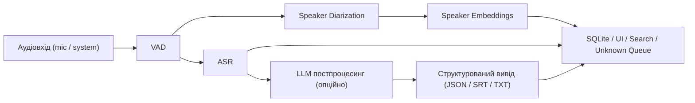
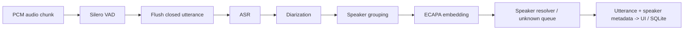

# Розділ 4. Система повного циклу: поточний стан застосунку

> Робочий Markdown для написання розділу диплома.
> Документ спеціально розділяє:
> - `реалізовано зараз у web_app`
> - `частково реалізовано`
> - `рекомендовано для фінальної версії розділу 4`

---

## 0. Короткий висновок

Поточний застосунок `Voice Diary` вже реалізує повний локальний desktop-first пайплайн для запису, сегментації мовлення, транскрипції, діаризації, побудови voice embeddings, ідентифікації мовців і збереження результатів у SQLite. Фактично це не абстрактний прототип, а працююча система на стеку `Electron + React 19 + FastAPI`, де frontend отримує результати в near-real-time через WebSocket, а backend обробляє аудіо через `Silero VAD`, `faster-whisper`, `pyannote` і `SpeechBrain ECAPA-TDNN`.

При цьому для дипломного тексту важливо чесно зафіксувати межі поточної реалізації: у репозиторії **ще немає** окремого модуля `WhisperX`, **немає** інтегрованого `LLM post-processing` у production pipeline, **немає** формально збережених `DER`/`ROC` таблиць для розділу експериментів, а експорт реалізовано у форматах `JSON / Markdown / CSV`, але не `SRT`.

---

## 1. Що вже є в застосунку

### 1.1 Реально реалізовані компоненти

| Компонент | Стан | Примітка |
|---|---|---|
| Захоплення мікрофона | Реалізовано | WebSocket PCM 16 kHz |
| Захоплення system audio | Реалізовано | Окремий потік `track=system` |
| VAD | Реалізовано | `Silero VAD` з dual-threshold hysteresis |
| ASR | Реалізовано | `faster-whisper`, дефолт `large-v3-turbo` |
| Cloud ASR fallback | Реалізовано | `ElevenLabs Scribe` |
| Diarization | Реалізовано | `pyannote/speaker-diarization-3.1` |
| Альтернативна diarization | Реалізовано частково | `NeMo Sortformer v2.1`, CUDA-only |
| Speaker embeddings | Реалізовано | `speechbrain/spkrec-ecapa-voxceleb` |
| Speaker identification | Реалізовано | cosine similarity + threshold |
| Unknown queue | Реалізовано | ручне резолвлення невідомих мовців |
| Збереження в БД | Реалізовано | SQLite + FTS5 |
| Пошук по транскриптах | Реалізовано | FTS5 search |
| Експорт сесій | Реалізовано | `JSON`, `MD`, `CSV` |
| Draft / near-real-time preview | Реалізовано частково | проміжні draft utterances |
| WhisperX | Немає в current app | логічне розширення |
| LLM post-processing | Немає в current app | є окремі експерименти поза app |
| SRT export | Немає в current app | логічне розширення |
| Token-level language tagging | Немає в current app | лише utterance-level / planned |

### 1.2 Фактичний технологічний стек

- Desktop shell: `Electron 41`
- Frontend: `React 19`, `TypeScript`, `Vite`
- State management: `TanStack React Query v5`
- Backend API: `FastAPI`
- Real-time transport: `WebSocket`
- Storage: `SQLite`, `FTS5`
- Audio processing: `NumPy`, `Torch`
- ASR: `faster-whisper`
- VAD: `silero-vad`
- Diarization: `pyannote.audio 4.0.3` з чекпоінтом `speaker-diarization-3.1`
- Embeddings: `SpeechBrain ECAPA-TDNN`

### 1.3 Важлива теза для диплома

Якщо в чернетках розділу 4 вже закладено `Flutter` або `Tauri`, це варто перенести в підрозділ про **альтернативи**, а не описувати як факт. Поточний застосунок реалізовано саме як `Electron + React + FastAPI` desktop-first систему.

---

## 2. 4.1 Архітектура системи

## 2.1 Логічна блок-схема для диплома



Цю схему варто трактувати як **логічну архітектуру модулів**, а не як буквальний порядок викликів у backend-коді.

## 2.2 Фактичний runtime order у поточному `web_app`



У поточній реалізації backend працює саме так: `VAD -> ASR -> diarization -> speaker grouping -> embeddings -> resolver`.

## 2.3 Одним реченням про кожен блок

- **Аудіовхід** приймає два незалежні потоки, мікрофонний і системний, щоб розділяти власну мову користувача та зовнішні джерела звуку.
- **VAD** визначає межі мовлення та відсікає тишу, щоб не передавати на важкі модулі весь безперервний аудіопотік.
- **Speaker diarization** розбиває мовлення на сегменти за мовцями всередині однієї репліки або аудіофрагмента.
- **Speaker embeddings** перетворюють голос мовця на вектор у просторі ознак, придатний для подальшого порівняння через cosine similarity.
- **ASR** перетворює мовлення на текст і повертає основну транскрипцію разом із мовою та confidence.
- **LLM постпроцесинг** у розширеній версії системи не транскрибує звук наново, а перевіряє, виправляє та нормалізує вже отриманий текст.
- **Структурований вивід** зберігає результат у форматі, зручному для інтерфейсу, пошуку, подальшого аналізу чи експорту.

## 2.4 Чому в current app ASR стоїть раніше за diarization

Тут немає магії і немає “правильного єдиного порядку” для всіх систем, є лише різні інженерні цілі.

- У **канонічному speaker-aware pipeline** часто зручно мислити як `VAD -> diarization -> embeddings / identification -> ASR`, якщо мета полягає у тому, щоб розділити мовців якомога раніше і далі транскрибувати вже speaker-conditioned сегменти.
- У **поточному `web_app`** diarization не керує самим декодуванням Whisper, а використовується після отримання тексту для speaker attribution всередині вже закритої VAD-репліки.
- Тобто ASR тут відповідає на запитання “що було сказано?”, а diarization + embeddings відповідають на запитання “хто це сказав?”.
- Такий порядок обрано як компроміс на користь простішої інтеграції, меншої затримки і стабільнішого desktop runtime, але він не є ідеальним для складного багатомовцевого overlap-сценарію.
- Якщо у дипломі ти хочеш описати **ідеологічно чисту** повну систему, тоді краще писати логічний ланцюг як `VAD -> diarization -> embeddings / speaker identification -> ASR -> optional LLM post-processing`.
- Якщо ж ти описуєш **саме поточний стан застосунку**, треба прямо сказати, що фактичний runtime order у коді інший: `VAD -> ASR -> diarization -> embeddings -> resolver`.

## 2.5 Як це працює в поточному `web_app`

Для диплома корисно явно зазначити, що **концептуальна** схема і **runtime order** у реалізації не повністю збігаються:

- концептуально систему краще описувати як `VAD -> diarization -> embeddings / speaker identification -> ASR`
- у поточному backend фактичний виклик іде як `VAD -> ASR -> diarization -> embeddings -> resolver`

Це не “помилка з підручника”, а практичний інженерний компроміс конкретної реалізації: backend спершу отримує текст репліки, а потім виконує speaker-level аналіз на вже закритому VAD-сегменті.

## 2.6 Обґрунтування вибору ASR-моделі для інтеграції

### Висновок

Для інтеграції в застосунок найкращим вибором є `whisper-large-v3-turbo`, не тому що це найточніша модель у всіх вимірах, а тому що вона дає **найкращий trade-off між точністю, швидкістю та локальною вартістю запуску**.

### Аргументи з локального бенчмарку

#### Набір `free_voices_no_oleh_2026-03-30`

| Модель | Варіант | WER | CER | Wall time, s |
|---|---|---:|---:|---:|
| `whisper-large-v3` | `force_uk` | 0.133253 | 0.082170 | 69.976 |
| `whisper-large-v3-turbo` | `force_uk` | 0.147789 | 0.087431 | 16.707 |
| `whisper-large-v2` | `force_uk` | 0.180497 | 0.104075 | 70.925 |
| `whisper-medium` | `force_uk` | 0.206541 | 0.123493 | 47.492 |
| `whisper-small` | `force_uk` | 0.294973 | 0.150182 | 24.246 |

#### Набір `free_2026-04-02`

| Модель | Варіант | WER | CER | Wall time, s |
|---|---|---:|---:|---:|
| `whisper-large-v3` | `force_uk` | 0.268963 | 0.190212 | 283.089 |
| `whisper-large-v3-turbo` | `force_uk` | 0.281314 | 0.198239 | 60.984 |
| `whisper-large-v2` | `force_uk` | 0.281604 | 0.187977 | 364.588 |
| `whisper-medium` | `force_uk` | 0.326359 | 0.218832 | 176.663 |
| `whisper-small` | `force_uk` | 0.413978 | 0.256756 | 92.555 |

### Інтерпретація

- `large-v3` дає найнижчий WER, тобто найкращу точність.
- `large-v3-turbo` поступається йому незначно, але працює приблизно у `4–5 разів швидше` на локальному запуску.
- За даними локального каталогу моделей, checkpoint `large-v3-turbo` має розмір близько `1.51 GB`, тоді як `large-v3` у трансформерному вигляді займає близько `23.0 GB`.
- Для desktop-застосунку, де критичні latency, старт моделі і вимоги до пам’яті, саме `large-v3-turbo` є кращим інтеграційним вибором.

### Академічне формулювання

У системі як базову ASR-модель було обрано `Whisper large-v3-turbo`, оскільки локальний бенчмарк показав, що вона зберігає точність, близьку до `large-v3`, але забезпечує істотно нижчий час обробки і суттєво менші вимоги до ресурсу. Для desktop-first сценарію це важливіше, ніж абсолютний мінімум WER, оскільки користувач очікує near-real-time реакції, а не лише офлайн максимально точного результату.

---

## 3. 4.2 VAD (Voice Activity Detection)

## 3.1 Поточний вибір

У застосунку вже реалізовано `Silero VAD`, причому не в найпростішому режимі, а з власною логікою `dual-threshold hysteresis`, preroll і post-padding.

### Чому Silero VAD

- мала модель і швидкий локальний запуск
- хороша якість на реальному шумному мовленні
- MIT-ліцензія
- активна спільнота та стабільний Python ecosystem
- добре підходить для desktop-пайплайну, де важливі простота розгортання і передбачувана latency

## 3.2 Коротке порівняння

| Підхід | Перевага | Недолік | Висновок |
|---|---|---|---|
| `Silero VAD` | хороший баланс точності і швидкості | треба акуратно тюнити пороги | оптимальний вибір для current app |
| `WebRTC VAD` | дуже швидкий і легкий | гірше поводиться на шумі та code-mixing pauses | підходить для ultra-light сценаріїв |
| `pyannote VAD` | потенційно точніший | важчий, дорожчий по ресурсах | доцільний у research/eval, але не як базовий desktop default |

## 3.3 Параметри в поточній реалізації

Поточна конфігурація backend:

- `vad_threshold = 0.60`
- `vad_negative_threshold = 0.45`
- `vad_min_silence_ms = 300`
- `vad_speech_pad_pre_ms = 300`
- `vad_speech_pad_post_ms = 400`
- `vad_min_utterance_ms = 300`
- `vad_max_utterance_ms = 13000`

## 3.4 Як ці параметри пояснювати в дипломі

- **`threshold`** керує моментом входу в стан мовлення: вищий поріг робить систему консервативнішою і зменшує false positives.
- **`negative_threshold`** керує виходом зі стану мовлення: нижчий поріг створює hysteresis band і не дає VAD “смикатись” на коротких коливаннях енергії.
- **`min_silence_duration_ms`** визначає, скільки тиші треба накопичити перед закриттям сегмента.
- **`min_speech_duration_ms`** у термінах цього застосунку фактично відповідає `vad_min_utterance_ms`, тобто мінімальній довжині буфера, яку система взагалі визнає реальною реплікою.

## 3.5 Специфіка для code-switched мовлення

Для українсько-англійського мовлення важливо враховувати, що перемикання мов або вставки технічних англіцизмів можуть звучати як короткі паузи або вага́ння. Якщо `min_silence_duration_ms` занадто малий, система почне надмірно дробити репліки саме в місцях code-switching; якщо ж він занадто великий, кілька окремих фраз можуть зливатися в один сегмент і збільшувати навантаження на diarization та ASR.

### Готове академічне формулювання

У поточній реалізації для VAD використовується `Silero VAD` з двома порогами активації і деактивації мовлення, що дає змогу реалізувати hysteresis та зменшити кількість хибних меж сегментації. Такий підхід є особливо важливим для code-switched мовлення, де короткі паузи між українськими та англійськими фрагментами не завжди означають завершення репліки.

---

## 4. 4.3 Speaker Diarization

## 4.1 Поточний вибір

Основним діаризаційним модулем у застосунку є `pyannote/speaker-diarization-3.1`, який у коді загорнуто в окремий provider. Додатково підтримується `NeMo Sortformer v2.1`, але як альтернативний CUDA-only backend.

## 4.2 Як пояснювати pipeline діаризації

У класичному вигляді speaker diarization включає:

1. **segmentation model**: визначає часові ділянки, де присутнє мовлення різних мовців;
2. **embedding extraction**: для кожного фрагмента обчислюється speaker representation;
3. **clustering**: фрагменти з близькими embeddings об’єднуються в speaker clusters, наприклад через agglomerative або spectral clustering.

### Важлива ремарка для current app

У поточній системі ці внутрішні кроки приховані всередині готового `pyannote` pipeline. Backend не реалізує clustering вручну для diarization; він лише отримує готові `speaker-labeled segments`.

## 4.3 `num_speakers`: known vs unknown

Теоретично `pyannote` може працювати як у режимі з відомою кількістю мовців (`num_speakers = N`), так і в unconstrained режимі, коли кількість мовців оцінюється автоматично. У поточній реалізації `web_app` використовується саме **unconstrained utterance-level diarization**, тобто параметр `num_speakers` користувачем не задається.

## 4.4 Метрика DER

Стандартна метрика для diarization:

`DER = missed speech + false alarm + speaker confusion`

де:

- `missed speech` означає, що система пропустила наявне мовлення;
- `false alarm` означає, що система помітила мовлення там, де його не було;
- `speaker confusion` означає, що система неправильно змінила або зберегла speaker label.

## 4.5 Що важливо чесно написати про поточний стан

У поточному репозиторії **немає збереженої формальної DER-оцінки** для 2–3 вручну розмічених записів. Тому в дипломі не варто вигадувати числові DER-значення. Коректний варіант:

- або винести DER як `future evaluation step`
- або підготувати вручну розмічені 2–3 аудіофайли і додати таблицю вже окремим експериментом

### Шаблон таблиці, який можна заповнити після ручної оцінки

| Запис | К-сть мовців (ground truth) | К-сть мовців (predicted) | DER | Коментар |
|---|---:|---:|---:|---|
| `sample_01` | 2 | TODO | TODO | TODO |
| `sample_02` | 3 | TODO | TODO | TODO |
| `sample_03` | 2 | TODO | TODO | TODO |

### Безпечне формулювання

На поточному етапі застосунок уже виконує speaker diarization на основі `pyannote.audio`, однак формалізована DER-оцінка на вручну анотованих записах ще не була винесена в окремий експериментальний підрозділ. Тому у даному розділі diarization описується як інтегрований функціональний модуль системи, а не як завершений benchmark-driven evaluation block.

---

## 5. 4.4 Voice Embeddings та Speaker Identification

## 5.1 Поточний вибір

Для побудови голосових представлень використовується `SpeechBrain ECAPA-TDNN`, модель `speechbrain/spkrec-ecapa-voxceleb`, яка повертає `192-dimensional L2-normalized embedding`.

## 5.2 Концепція

Speaker embedding можна описувати як проєкцію голосу в `d-vector` простір, де близькість двох векторів за cosine similarity відповідає схожості голосових характеристик двох мовців.

## 5.3 Як це працює в застосунку

1. Після завершення utterance backend отримує diarized speaker group.
2. Для кожної групи обчислюється `ECAPA embedding`.
3. Якщо мовець уже має voice profiles у БД, система порівнює новий embedding з наявними через cosine similarity.
4. Якщо поріг перевищено, сегмент прив’язується до existing contact.
5. Якщо поріг не перевищено, сегмент потрапляє в `unknown_queue`.
6. Після ручного підтвердження з unknown queue формується новий `voice_profile`.

Таким чином застосунок реалізує **cross-session speaker identification**, а не лише session-local speaker labeling.

## 5.4 Порогове рішення

Поточний код має:

- runtime config default: `speaker_identification_threshold = 0.5`
- історичні обговорення в документах: поріг `0.82` виявився завищеним для реального single-mic аудіо

### Емпіричні спостереження з локального аналізу

Для same-speaker пар у `docs/voice-recognition-review.md` зафіксовано:

- `min = 0.582`
- `p25 = 0.676`
- `median = 0.763`
- `p75 = 0.825`
- `p95 = 1.000`

А для unresolved segments того ж мовця були зафіксовані значення:

- `0.508`
- `0.595`
- `0.621`
- `0.741`
- `0.746`

### Інтерпретація

Це означає, що жорсткий поріг на рівні `0.82` дійсно відсікав багато коректних збігів, тоді як область `0.55–0.65` виглядає значно реалістичнішою для noisy single-mic сценарію.

## 5.5 ROC-крива

У репозиторії є інструмент `backend/scripts/score_histogram.py`, який будує розподіли `SAME` і `DIFF` cosine scores та пропонує threshold за balanced accuracy, але **готової ROC-кривої в матеріалах repo немає**. Тому для диплома коректно написати:

- ROC/AUC аналіз є методологічно правильним наступним кроком;
- на поточному етапі threshold tuning виконувався через гістограми cosine similarity.

### Академічне формулювання

У застосунку реалізовано механізм speaker identification на основі `ECAPA-TDNN` embeddings та cosine similarity. Емпіричний аналіз показав, що для реального одно-мікрофонного запису надто високий поріг прийняття рішення призводить до великої кількості хибних відхилень, тому threshold tuning має виконуватись не евристично, а на основі розподілу `same-speaker` та `different-speaker` score.

---

## 6. 4.5 ASR модуль

## 6.1 Що реально інтегровано зараз

У застосунку інтегровано `WhisperASRProvider`, який використовує:

- основний backend: `faster-whisper`
- fallback backend: `transformers`
- default model: `large-v3-turbo`

## 6.2 Що варто писати про WhisperX

У поточному `web_app` **WhisperX не інтегрований**. Якщо в розділі 4.5 потрібно описати `WhisperX` як фінальну системну версію, це треба подати як **рекомендоване розширення**, а не як уже реалізований компонент.

### Коректне формулювання

Поточна реалізація використовує `faster-whisper` для побудови базової транскрипції на рівні utterance timestamps. Для подальшого розвитку системи доцільно інтегрувати `WhisperX`, який додає forced alignment і word-level timestamps, що є важливим для точного підрахунку `CS-WER` та побудови синхронізованих субтитрів.

## 6.3 Чому word-level timestamps важливі

- точніше вимірюється quality на code-mixed spans
- легше вирівнювати транскрипт із субтитрами
- можна будувати token-level language tags у часі
- можна точніше поєднувати diarization segments з текстом

## 6.4 Мовна підказка і auto-detect у поточному backend

Поточний backend приймає `language_hint` на рівні сесії, передає його в `asr.transcribe(audio, language_hint)`, а також має механізм `language_allowlist`:

- якщо `language_hint` відомий, він може форсувати бажану мову
- якщо language confidence низький, backend може ретрансрибувати аудіо з мовами з allowlist
- за відсутності жорсткої підказки можливий auto-detect

### Практична рекомендація для диплома

- для чисто українських записів доцільно використовувати `force_uk`
- для реального code-mixing сценарію краще використовувати `auto-detect` або м’який allowlist `en,uk`

### Важливе зауваження

У поточному frontend немає повноцінного token-level представлення code-switching, тому навіть при коректній ASR-транскрипції змішаність мов ще не експлуатується UI повною мірою.

---

## 7. 4.6 LLM постпроцесинг

## 7.1 Поточний стан

У `web_app` **немає production-інтеграції LLM post-processing** після Whisper. Тобто LLM ще не є частиною backend pipeline застосунку.

## 7.2 Що вже є в локальних дослідженнях

У суміжному локальному бенчмарку `benchmark_codemixing` є експерименти з мультимодальними LLM-моделями, зокрема `google/gemma-4-E2B-it`, але вони стосуються переважно **direct audio transcription**, а не post-editing поверх Whisper output.

### Приклад наявного результату

Для `google/gemma-4-E2B-it` у run `valera_gemma_it_2026-04-04`:

- `WER = 0.282787`
- `CER = 0.147541`
- `samples = 6`
- `wall_time_seconds = 571.650`

### Інтерпретація

Цей результат корисний не як аргумент на користь LLM як primary ASR, а навпаки як підстава використовувати LLM **лише як post-processor**, бо він занадто повільний як базовий транскриптор для near-real-time desktop pipeline.

## 7.3 Науково коректна постановка задачі для розділу 4.6

LLM у цій системі доцільно вводити не для повторної транскрипції аудіо, а для таких задач:

1. **верифікація Whisper transcript**
2. **виявлення галюцинацій**
3. **мовна ідентифікація на рівні токенів**
4. **нормалізація чисел, абревіатур і пунктуації**
5. **опційна перевірка перекладного режиму Whisper**

## 7.4 Що можна чесно написати в дипломі

Наразі LLM post-processing розглядається як дослідницьке розширення системи. Основний ASR шар уже вирішує задачу перетворення мовлення на текст, тоді як LLM шар пропонується використати для семантичної верифікації, виправлення code-mixed фрагментів і токен-рівневого маркування мов без повторного прогону повної ASR-моделі.

## 7.5 Порівняння з rule-based language tagging

### Rule-based підхід

- простий
- швидкий
- працює для очевидних англомовних токенів латинкою
- погано працює на запозиченнях, транслітерації та морфологічно адаптованих словах типу `зафорвардити`

### LLM підхід

- краще працює на контекстно-залежних запозиченнях
- може враховувати сусідні слова і синтаксис
- дорожчий за latency
- потребує окремої evaluation methodology

## 7.6 Prompt template, який можна вставити в розділ

Нижче приклад **пропонованого**, а не реалізованого prompt:

```text
You are given:
1. an original ASR transcript in Ukrainian-English code-mixed speech,
2. an optional Whisper translation to English,
3. optional task context.

Your job is NOT to translate the text.
Your job is to:
- correct obvious ASR errors,
- preserve the original language of each token,
- mark each token with [UK] or [EN],
- normalize punctuation, abbreviations and numbers only when confidence is high,
- flag likely hallucinations or semantically inconsistent spans.

Return JSON with fields:
- corrected_text
- token_language_tags
- normalized_text
- hallucination_flags
- notes
```

## 7.7 Що відсутнє в current materials

У наявних матеріалах **немає** готового експерименту `50 прикладів before/after LLM pass`. Тому у фінальному дипломному тексті не варто писати, що LLM already improved accuracy by X%, якщо такого числа ще не пораховано.

### Правильний варіант подачі

- або позначити це як майбутній експеримент;
- або окремо запустити `Whisper output -> Gemma correction -> WER re-evaluation` на 50 прикладах.

---

## 8. 4.7 Застосунок

## 8.1 Реальна архітектура застосунку

Поточний застосунок є desktop-first рішенням на базі `Electron`, де:

- renderer реалізовано на `React 19 + TypeScript`
- backend запускається локально як `FastAPI` service
- frontend і backend взаємодіють через `REST + WebSocket`

Тобто в current state це не Flutter-застосунок і не Tauri-застосунок.

## 8.2 Ключові екрани, які вже є

### 1. Current Session

- запуск запису
- live transcript
- окремі потоки `mic` і `system`
- audio level meter
- draft utterances

### 2. All Sessions

- перегляд історії сесій
- пошук по utterances у вибраній сесії
- експорт у `JSON / MD / CSV`

### 3. Unknown Queue

- список невідомих мовців
- candidates з cosine scores
- resolve / skip
- каскадне доідентифікування після резолву

### 4. Contacts

- список speaker profiles
- confidence по voiceprint
- utterances, прив’язані до контакту

### 5. Search

- повнотекстовий пошук по транскриптах

### 6. Settings

- вибір ASR / diarization / embedding provider
- threshold tuning
- preload / unload моделей
- blocklist
- pipeline tuning

## 8.3 Що збігається з бажаним описом, а що ні

| Бажана функція з outline | Стан у current app |
|---|---|
| Запис із waveform | Частково: є audio level meter, повного waveform немає |
| VAD indicator | Частково: поведінка near-real-time є, явний індикатор як окремий UI-елемент не центральний |
| Real-time transcription | Є, у near-real-time режимі через chunk processing |
| Color-coding по мовах UK/EN | Немає на token level |
| Export SRT/TXT/JSON | Є лише `JSON / MD / CSV` |
| Speaker enrollment | Є через `unknown_queue` і `contacts` |

## 8.4 Локально vs API

Цей пункт особливо сильний для диплома, бо він уже частково реалізований.

### Локальний режим

- `faster-whisper`
- локальний `pyannote`
- локальний `ECAPA`

### API-режим

- `ElevenLabs Scribe` як cloud ASR provider

Тобто користувач уже зараз може концептуально перемикатися між локальним і API-підходом принаймні на ASR-рівні.

### Готове формулювання

Архітектура застосунку спроєктована як provider-based система, тому окремі модулі можуть працювати або локально, або через зовнішній API. У поточному стані це вже реалізовано для ASR: локальний режим використовує `faster-whisper`, а cloud-режим використовує `ElevenLabs Scribe`. Такий підхід дозволяє користувачу балансувати між приватністю, швидкістю, вартістю та якістю.

---

## 9. Критичні обмеження current state

Ці пункти корисно або прямо вказати в дипломі, або винести в “обмеження системи”.

1. **Немає WhisperX**.
2. **Немає інтегрованого LLM post-processing**.
3. **Немає SRT export**.
4. **Немає формальної DER-таблиці**.
5. **Немає ROC/AUC-графіка для speaker ID**.
6. **Є відомий Windows issue з ECAPA path composition (`WinError 123`)**, який може ламати завантаження embedding provider.
7. **Token-level language tagging відсутній**, тому code-mixing у UI поки що не візуалізується повністю.

---

## 10. Як це безпечно подати в дипломі

### Якщо треба описати лише те, що вже працює

Акцент робиться на:

- локальному full-cycle pipeline
- VAD
- ASR
- diarization
- voice embeddings
- speaker identification
- unknown queue
- desktop UI

### Якщо треба описати “цільову систему”

Тоді варто явно розділити:

- `поточна реалізація`
- `заплановане розширення`

і для `WhisperX`, `LLM post-processing`, `SRT export`, `token-level language tagging` використовувати формулювання на кшталт:

> У фінальній версії системи доцільно додати...

а не:

> У системі реалізовано...

---

## 11. Готові фрагменти тексту для вставки

## 11.1 Короткий вступ до розділу

У цьому розділі описано поточний стан розробленої системи повного циклу для транскрипції та аналізу мовлення. Застосунок реалізовано як desktop-first рішення, яке виконує запис аудіо, автоматичне виділення мовленнєвих сегментів, розпізнавання мовлення, діаризацію, побудову голосових embeddings, ідентифікацію мовців і збереження результатів у структурованому вигляді. Архітектурно система побудована за provider-based принципом, що дозволяє замінювати окремі модулі без повної перебудови застосунку.

## 11.2 Короткий фрагмент про ASR-вибір

Хоча модель `Whisper large-v3` показала найкращу точність у локальному бенчмарку, для інтеграції в застосунок було обрано `Whisper large-v3-turbo`. Причина полягає в тому, що ця модель демонструє лише незначне зниження точності відносно `large-v3`, але працює у кілька разів швидше та потребує суттєво менше ресурсів пам’яті. Для near-real-time desktop-сценарію саме такий компроміс між якістю та швидкодією є найдоцільнішим.

## 11.3 Короткий фрагмент про speaker identification

Для ідентифікації мовців у системі використано embeddings, побудовані моделлю `ECAPA-TDNN`, та cosine similarity як функцію близькості. Після ручного підтвердження невідомого мовця в unknown queue система зберігає voice profile і надалі може автоматично співвідносити нові голосові сегменти з уже відомими контактами. Такий підхід дає змогу реалізувати міжсесійну ідентифікацію мовців, а не лише локальне маркування спікерів у межах одного запису.

## 11.4 Короткий фрагмент про LLM

На поточному етапі LLM-модуль не інтегрований у production pipeline застосунку, однак розглядається як перспективний шар семантичного постпроцесингу. Його основною задачею має бути не повторна транскрипція аудіо, а верифікація та виправлення помилок ASR, токен-рівневе маркування мов у code-mixed мовленні та нормалізація тексту перед фінальним експортом.

---

## 12. Локальні джерела, на які спирається цей файл

- `D:\web_app\docs\utterance-pipeline.md`
- `D:\web_app\docs\voice-recognition-review.md`
- `D:\web_app\docs\backend-flaws.md`
- `D:\web_app\backend\config.py`
- `D:\web_app\backend\providers\vad.py`
- `D:\web_app\backend\providers\asr.py`
- `D:\web_app\backend\providers\diarization.py`
- `D:\web_app\backend\providers\embedding.py`
- `D:\web_app\backend\pipeline\coordinator.py`
- `D:\web_app\backend\api\routers\audio_ws.py`
- `D:\web_app\backend\api\routers\config_rt.py`
- `D:\web_app\frontend\src\components\CurrentSession.tsx`
- `D:\web_app\frontend\src\components\AllSessions.tsx`
- `D:\web_app\frontend\src\components\Settings.tsx`
- `D:\MS_diploma\benchmark_codemixing\results\free_voices_no_oleh_2026-03-30\leaderboard_normalized.csv`
- `D:\MS_diploma\benchmark_codemixing\results\free_2026-04-02\leaderboard_normalized.csv`
- `D:\MS_diploma\benchmark_codemixing\runtime\tmp\model_sizes_report.json`
- `D:\MS_diploma\benchmark_codemixing\runtime\legacy\llm_results_pre_refactor\results\results\valera_gemma_it_2026-04-04\leaderboard_normalized.csv`

---

## 13. Що ще варто доробити перед фінальним текстом диплома

1. Окремо порахувати `DER` на 2–3 вручну анотованих записах.
2. Побудувати `SAME/DIFF` ROC-криву для speaker identification.
3. Додати хоча б 50 прикладів `Whisper -> LLM correction` і перерахувати WER/CER після постпроцесингу.
4. Якщо потрібен subtitle use case, додати `WhisperX` або інший forced alignment модуль.
5. Якщо потрібен user-facing subtitle export, додати `SRT` і `TXT`.
